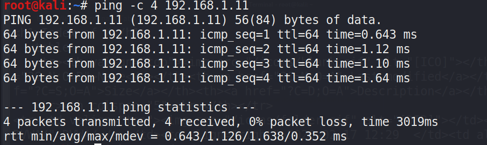

## Network Configuration

Kali attacker (192.168.1.50) and DVWA server (192.168.1.11) configured on same internal network.

## Connectivity Check

Successful ICMP communication confirms both machines are reachable without firewall filtering.

## DVWA Access

DVWA application is accessible from the attacker machine over HTTP.
